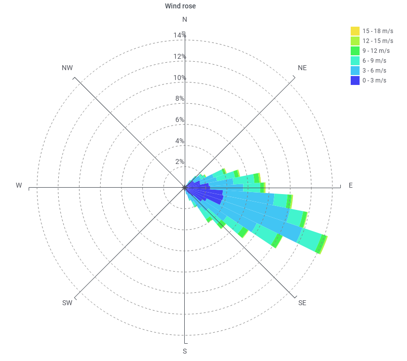

This Grafana plugin looks like:




# Disclaimer

This plugin has been tested with Grafana 10.x but there's still
work to do before submitting to Grafana. New versions may require changes to
the query or configuration.

# Usage

Install:

```sh
$ sudo su -
# cd /var/lib/grafana/plugins
# git clone https://github.com/spectraphilic/grafana-windrose.git
```

Allow loading this plugin, in ``/etc/grafana/grafana.ini``:

```
[plugins]
allow_loading_unsigned_plugins = spectraphilic-windrose-panel
```

Restart Grafana service.

Add a panel to your dashboard with the *Windrose* visualization type. Set up the
query to provide data with `speed` and `direction` fields. The speed can be in
the unit of your choice (can be set in the settings), while the direction is
always in degrees.

## PostgreSQL

Example query for PostgreSQL:

```sql
SELECT
  time,
  field1 AS speed,
  field2 AS direction
FROM table
WHERE $__unixEpochFilter("time")
ORDER BY time
```

## ClickHouse

Example for ClickHouse:

```sql
SELECT
  $timeSeries as time,
  field1 AS speed,
  field2 AS direction
FROM table
WHERE $timeFilter
ORDER BY time
```

## Prometheus

This is valid as well for prometheus-compatible data sources such as
VictoriaMetrics.

Set a query for speed:

- Metrics browser: ``meteo_ws_mean{location="$location"}``
- Legend: ``speed``

Set another query for direction:

- Metrics browser: ``meteo_wd_mean{location="$location"}``
- Legend: ``direction``

This information was provided by @newrushbolt ; for further details see
https://github.com/spectraphilic/grafana-windrose/issues/18#issuecomment-1007648330

## Flux

Example for InfluxDB v2 filled from SignalK.

```
from(bucket: "bucket")
  |> range(start: v.timeRangeStart, stop: v.timeRangeStop)
  |> filter(fn: (r) => r["_measurement"] == "environment.wind.speedTrue" or r["_measurement"] == "environment.wind.directionTrue")
  |> filter(fn: (r) => r["_field"] == "value")
  |> pivot(rowKey:["_time"], columnKey: ["_measurement"], valueColumn: "_value") // put dir and speed values into the same row based on timestamps
  |> filter(fn: (r) => exists r["environment.wind.directionTrue"] and exists r["environment.wind.speedTrue"]) // drop rows that don't have both values
  |> rename(columns: {"environment.wind.directionTrue": "directionRad", "environment.wind.speedTrue": "speedMps"})
  |> map(fn: (r) => ({ r with  direction: r.directionRad / 3.14 * 180.0 })) // convert to degrees from radians
  |> map(fn: (r) => ({ r with  speed: r.speedMps / 0.514 })) // convert to knots from m/s
  |> aggregateWindow(every: v.windowPeriod, fn: first, column: "direction", createEmpty: false) // sample the first row for each window (real aggregation would show fake values in gusty winds)
```

# Development

Install:

```sh
$ npm run dev
$ docker-compose up
```
